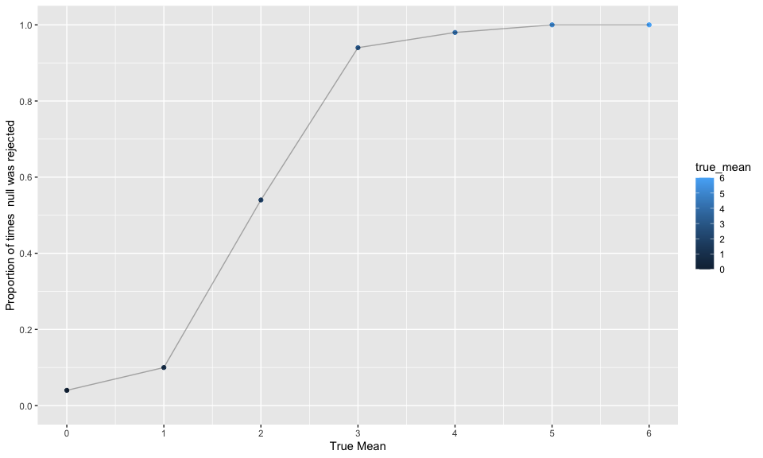
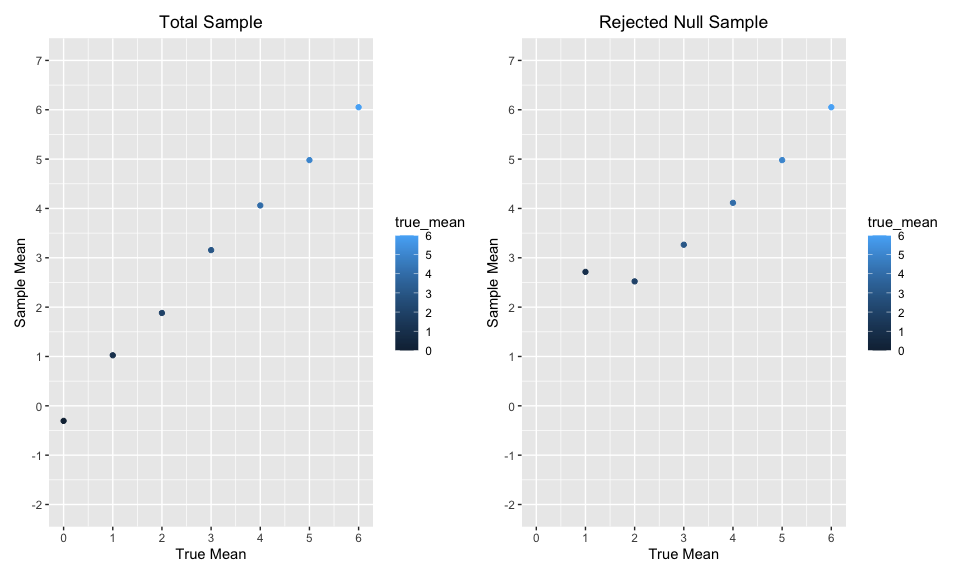

p8105_hw5_nh2706
================
Niklas Hess
2022-11-16

# Problem 1

Solutions provided!

# Problem 2

### Import Data & Initial Description

``` r
raw_homicide_df = read_csv("./data/homicide-data.csv", na = c("","Unknown"))
```

    ## Rows: 52179 Columns: 12
    ## ── Column specification ────────────────────────────────────────────────────────
    ## Delimiter: ","
    ## chr (8): uid, victim_last, victim_first, victim_race, victim_sex, city, stat...
    ## dbl (4): reported_date, victim_age, lat, lon
    ## 
    ## ℹ Use `spec()` to retrieve the full column specification for this data.
    ## ℹ Specify the column types or set `show_col_types = FALSE` to quiet this message.

The raw data has 12 variables and 52179 observations. Key variables
include reported_date, victim_last, victim_first, victim_race,
victim_age, victim_sex, city.

### Summarize Homicides by City

``` r
homicide_df = raw_homicide_df %>%
  mutate(city_state = str_c(city, state, sep = ", "),
         solution = ifelse(disposition == "Closed by arrest", "Solved", "Unsolved")) %>%
  group_by(city_state) %>%
  summarize(n = n(),
            unsolved = sum(solution == "Unsolved")) %>%
  knitr::kable()

homicide_df
```

| city_state         |    n | unsolved |
|:-------------------|-----:|---------:|
| Albuquerque, NM    |  378 |      146 |
| Atlanta, GA        |  973 |      373 |
| Baltimore, MD      | 2827 |     1825 |
| Baton Rouge, LA    |  424 |      196 |
| Birmingham, AL     |  800 |      347 |
| Boston, MA         |  614 |      310 |
| Buffalo, NY        |  521 |      319 |
| Charlotte, NC      |  687 |      206 |
| Chicago, IL        | 5535 |     4073 |
| Cincinnati, OH     |  694 |      309 |
| Columbus, OH       | 1084 |      575 |
| Dallas, TX         | 1567 |      754 |
| Denver, CO         |  312 |      169 |
| Detroit, MI        | 2519 |     1482 |
| Durham, NC         |  276 |      101 |
| Fort Worth, TX     |  549 |      255 |
| Fresno, CA         |  487 |      169 |
| Houston, TX        | 2942 |     1493 |
| Indianapolis, IN   | 1322 |      594 |
| Jacksonville, FL   | 1168 |      597 |
| Kansas City, MO    | 1190 |      486 |
| Las Vegas, NV      | 1381 |      572 |
| Long Beach, CA     |  378 |      156 |
| Los Angeles, CA    | 2257 |     1106 |
| Louisville, KY     |  576 |      261 |
| Memphis, TN        | 1514 |      483 |
| Miami, FL          |  744 |      450 |
| Milwaukee, wI      | 1115 |      403 |
| Minneapolis, MN    |  366 |      187 |
| Nashville, TN      |  767 |      278 |
| New Orleans, LA    | 1434 |      930 |
| New York, NY       |  627 |      243 |
| Oakland, CA        |  947 |      508 |
| Oklahoma City, OK  |  672 |      326 |
| Omaha, NE          |  409 |      169 |
| Philadelphia, PA   | 3037 |     1360 |
| Phoenix, AZ        |  914 |      504 |
| Pittsburgh, PA     |  631 |      337 |
| Richmond, VA       |  429 |      113 |
| Sacramento, CA     |  376 |      139 |
| San Antonio, TX    |  833 |      357 |
| San Bernardino, CA |  275 |      170 |
| San Diego, CA      |  461 |      175 |
| San Francisco, CA  |  663 |      336 |
| Savannah, GA       |  246 |      115 |
| St. Louis, MO      | 1677 |      905 |
| Stockton, CA       |  444 |      266 |
| Tampa, FL          |  208 |       95 |
| Tulsa, AL          |    1 |        0 |
| Tulsa, OK          |  583 |      193 |
| Washington, DC     | 1345 |      589 |

### Himicides in Baltimore - Detail

# Problem 3

``` r
n = 30
sd = 5

true_mean = 0:6

dataset = function(x) {
  rnorm(n, x, sd)}

output = vector("list", length = 50)
inter <- data.frame(matrix(ncol = 3, nrow = 50))
colnames(inter) <- c('true_mean', 'sample_mean', 'p-value')


combine_function = function(y){
  inter2 = list()
  for (i in 1:50) {
    output[[i]] = dataset(y)
    a = broom::tidy(t.test(output[[i]]))
    inter[i,1] = y
    inter[i,2] = a[[1]]
    inter[i,3] = a[[3]]}
  inter2 = rbind(inter2, inter)}

final = map(true_mean, combine_function)
```

``` r
df_final = data.frame(c(1:50),final[[1]])
for (i in 2:7) {
  df = data.frame(c(1:50),final[[i]])
  df_final = rbind(df_final, df)
  }

df_final = df_final %>%
  mutate(reject = ifelse(p.value < 0.05, TRUE, FALSE))
```

``` r
reject_plot = df_final %>%
  group_by(true_mean) %>% 
  summarize(power = sum(reject)/50) %>% 
  ggplot(aes(x = true_mean, y = power)) +
  geom_point(aes(colour = true_mean)) +
  geom_line(alpha = 0.3) +
  labs(x = "True Mean", 
       y = "Proportion of times  null was rejected") +
  scale_x_continuous(breaks = seq(0,6,by = 1)) +
  scale_y_continuous(limits = c(0,1), breaks = seq(0,1,by = 0.2))

reject_plot
```



``` r
Comparison_plot = df_final %>%
  group_by(true_mean) %>%
  summarize(mean_sample = mean(sample_mean)) %>%
  ggplot(aes(x = true_mean, y = mean_sample)) +
  geom_point(aes(colour = true_mean)) +
  labs(title = "Total Sample",
       x = "True Mean", 
       y = "Sample Mean") +
  scale_x_continuous(limits = c(0,6), breaks = seq(0,6,1)) +
  scale_y_continuous(limits = c(-2,7), breaks = seq(-2,7,1)) +
  theme(plot.title = element_text(hjust = 0.5))

Comparison_reject = df_final %>%
  group_by(true_mean) %>%
  filter(p.value < 0.05) %>%
  summarize(mean_sample = mean(sample_mean)) %>%
  ggplot(aes(x = true_mean, y = mean_sample)) +
  geom_point(aes(colour = true_mean)) +
  labs(title = "Rejected Null Sample",
       x = "True Mean", 
       y = "Sample Mean") +
  scale_x_continuous(limits = c(0,6), breaks = seq(0,6,1)) +
  scale_y_continuous(limits = c(-2,7), breaks = seq(-2,7,1)) +
  theme(plot.title = element_text(hjust = 0.5))

Comparison_plot + Comparison_reject
```

    ## Warning: Removed 1 rows containing missing values (geom_point).


