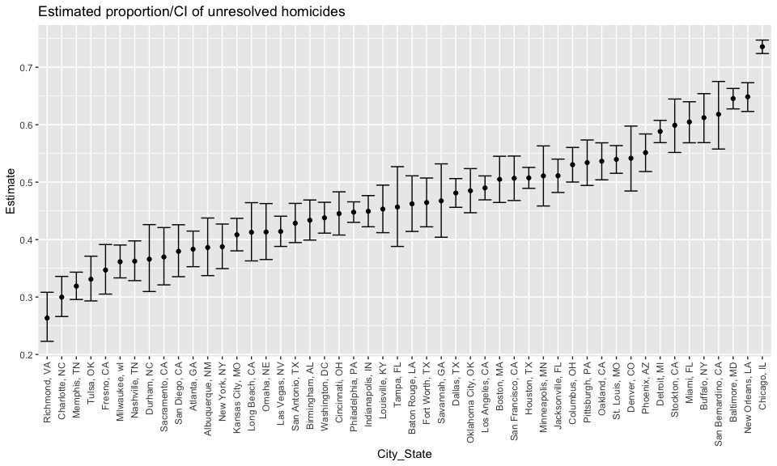
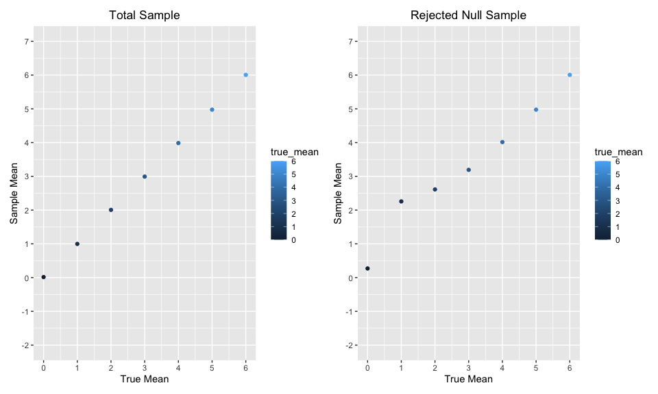

p8105_hw5_nh2706
================
Niklas Hess
2022-11-16

# Problem 1

Solutions provided!

# Problem 2

### Import Data & Initial Description

First, U=I import the data from the data repository within this project.

``` r
raw_homicide_df = read_csv("./data/homicide-data.csv", na = c("","Unknown"))
```

The raw data has 12 variables and 52179 observations. Key variables
include reported_date, victim_last, victim_first, victim_race,
victim_age, victim_sex, city.

### Summarize Homicides by City

As a next step, I summarize the data by `City, State`, showing the
number of total homicides and unsolved homicides. The output can be seen
below the code.

``` r
homicide_df = raw_homicide_df %>%
  mutate(city_state = str_c(city, state, sep = ", "),
         solution = ifelse(disposition == "Closed by arrest", "Solved", "Unsolved")) %>%
  group_by(city_state) %>%
  filter(city_state != "Tulsa, AL") %>% #Excluded Tulsa, as it is not real and only has 1 observation.
  summarize(n = n(),
            unsolved = sum(solution == "Unsolved"))


knitr::kable(homicide_df)
```

| city_state         |    n | unsolved |
|:-------------------|-----:|---------:|
| Albuquerque, NM    |  378 |      146 |
| Atlanta, GA        |  973 |      373 |
| Baltimore, MD      | 2827 |     1825 |
| Baton Rouge, LA    |  424 |      196 |
| Birmingham, AL     |  800 |      347 |
| Boston, MA         |  614 |      310 |
| Buffalo, NY        |  521 |      319 |
| Charlotte, NC      |  687 |      206 |
| Chicago, IL        | 5535 |     4073 |
| Cincinnati, OH     |  694 |      309 |
| Columbus, OH       | 1084 |      575 |
| Dallas, TX         | 1567 |      754 |
| Denver, CO         |  312 |      169 |
| Detroit, MI        | 2519 |     1482 |
| Durham, NC         |  276 |      101 |
| Fort Worth, TX     |  549 |      255 |
| Fresno, CA         |  487 |      169 |
| Houston, TX        | 2942 |     1493 |
| Indianapolis, IN   | 1322 |      594 |
| Jacksonville, FL   | 1168 |      597 |
| Kansas City, MO    | 1190 |      486 |
| Las Vegas, NV      | 1381 |      572 |
| Long Beach, CA     |  378 |      156 |
| Los Angeles, CA    | 2257 |     1106 |
| Louisville, KY     |  576 |      261 |
| Memphis, TN        | 1514 |      483 |
| Miami, FL          |  744 |      450 |
| Milwaukee, wI      | 1115 |      403 |
| Minneapolis, MN    |  366 |      187 |
| Nashville, TN      |  767 |      278 |
| New Orleans, LA    | 1434 |      930 |
| New York, NY       |  627 |      243 |
| Oakland, CA        |  947 |      508 |
| Oklahoma City, OK  |  672 |      326 |
| Omaha, NE          |  409 |      169 |
| Philadelphia, PA   | 3037 |     1360 |
| Phoenix, AZ        |  914 |      504 |
| Pittsburgh, PA     |  631 |      337 |
| Richmond, VA       |  429 |      113 |
| Sacramento, CA     |  376 |      139 |
| San Antonio, TX    |  833 |      357 |
| San Bernardino, CA |  275 |      170 |
| San Diego, CA      |  461 |      175 |
| San Francisco, CA  |  663 |      336 |
| Savannah, GA       |  246 |      115 |
| St. Louis, MO      | 1677 |      905 |
| Stockton, CA       |  444 |      266 |
| Tampa, FL          |  208 |       95 |
| Tulsa, OK          |  583 |      193 |
| Washington, DC     | 1345 |      589 |

### Homocides in Baltimore - Detail

As a third step, I am taking a closer look at **Baltimore, MD**,
conducting a `prop.test`. The result will show the estimated proportion
of homicides that are unsolved and associated Confidence Interval - see
tibble table below

``` r
baltimore_homicide = homicide_df %>%
  filter(city_state == "Baltimore, MD")

  
prop.test(
  x = baltimore_homicide %>% pull(unsolved), 
  n = baltimore_homicide %>% pull(n)) %>%
  saveRDS(file = "data/baltimore_proptest.rds")


readRDS(file = "data/baltimore_proptest.rds") %>%
  broom::tidy() %>%
  select(estimate, conf.low, conf.high) %>%
  knitr::kable(digits = 3)
```

| estimate | conf.low | conf.high |
|---------:|---------:|----------:|
|    0.646 |    0.628 |     0.663 |

### Prop.test Function for each city

Next, I am conducting the same test as above for each of the cities
within the raw_dataset. The final output shows the estimated proportion
of homicides that are unsolved and associated Confidence Interval for
each city.

``` r
city_result = 
  homicide_df %>% 
  mutate(
    proportions = map2(.x = unsolved, .y = n, ~prop.test(x = .x, n = .y)),
    cleaned = map(.x = proportions, ~broom::tidy(.x))) %>% 
  unnest(cleaned) %>% 
  select(city_state, estimate, conf.low, conf.high)

city_result %>%
  knitr::kable(digits = 3)
```

| city_state         | estimate | conf.low | conf.high |
|:-------------------|---------:|---------:|----------:|
| Albuquerque, NM    |    0.386 |    0.337 |     0.438 |
| Atlanta, GA        |    0.383 |    0.353 |     0.415 |
| Baltimore, MD      |    0.646 |    0.628 |     0.663 |
| Baton Rouge, LA    |    0.462 |    0.414 |     0.511 |
| Birmingham, AL     |    0.434 |    0.399 |     0.469 |
| Boston, MA         |    0.505 |    0.465 |     0.545 |
| Buffalo, NY        |    0.612 |    0.569 |     0.654 |
| Charlotte, NC      |    0.300 |    0.266 |     0.336 |
| Chicago, IL        |    0.736 |    0.724 |     0.747 |
| Cincinnati, OH     |    0.445 |    0.408 |     0.483 |
| Columbus, OH       |    0.530 |    0.500 |     0.560 |
| Dallas, TX         |    0.481 |    0.456 |     0.506 |
| Denver, CO         |    0.542 |    0.485 |     0.598 |
| Detroit, MI        |    0.588 |    0.569 |     0.608 |
| Durham, NC         |    0.366 |    0.310 |     0.426 |
| Fort Worth, TX     |    0.464 |    0.422 |     0.507 |
| Fresno, CA         |    0.347 |    0.305 |     0.391 |
| Houston, TX        |    0.507 |    0.489 |     0.526 |
| Indianapolis, IN   |    0.449 |    0.422 |     0.477 |
| Jacksonville, FL   |    0.511 |    0.482 |     0.540 |
| Kansas City, MO    |    0.408 |    0.380 |     0.437 |
| Las Vegas, NV      |    0.414 |    0.388 |     0.441 |
| Long Beach, CA     |    0.413 |    0.363 |     0.464 |
| Los Angeles, CA    |    0.490 |    0.469 |     0.511 |
| Louisville, KY     |    0.453 |    0.412 |     0.495 |
| Memphis, TN        |    0.319 |    0.296 |     0.343 |
| Miami, FL          |    0.605 |    0.569 |     0.640 |
| Milwaukee, wI      |    0.361 |    0.333 |     0.391 |
| Minneapolis, MN    |    0.511 |    0.459 |     0.563 |
| Nashville, TN      |    0.362 |    0.329 |     0.398 |
| New Orleans, LA    |    0.649 |    0.623 |     0.673 |
| New York, NY       |    0.388 |    0.349 |     0.427 |
| Oakland, CA        |    0.536 |    0.504 |     0.569 |
| Oklahoma City, OK  |    0.485 |    0.447 |     0.524 |
| Omaha, NE          |    0.413 |    0.365 |     0.463 |
| Philadelphia, PA   |    0.448 |    0.430 |     0.466 |
| Phoenix, AZ        |    0.551 |    0.518 |     0.584 |
| Pittsburgh, PA     |    0.534 |    0.494 |     0.573 |
| Richmond, VA       |    0.263 |    0.223 |     0.308 |
| Sacramento, CA     |    0.370 |    0.321 |     0.421 |
| San Antonio, TX    |    0.429 |    0.395 |     0.463 |
| San Bernardino, CA |    0.618 |    0.558 |     0.675 |
| San Diego, CA      |    0.380 |    0.335 |     0.426 |
| San Francisco, CA  |    0.507 |    0.468 |     0.545 |
| Savannah, GA       |    0.467 |    0.404 |     0.532 |
| St. Louis, MO      |    0.540 |    0.515 |     0.564 |
| Stockton, CA       |    0.599 |    0.552 |     0.645 |
| Tampa, FL          |    0.457 |    0.388 |     0.527 |
| Tulsa, OK          |    0.331 |    0.293 |     0.371 |
| Washington, DC     |    0.438 |    0.411 |     0.465 |

### Graphing Homicide Rates in each city

Finally, I am using the data created in the previous step to graph the
estimated proportion of unsolved homicides and the confidence interval
for each city within a plot. The cities are organized in accordance ti
their proportion of unsolved homicides, and errorbars have been added.

``` r
city_graph = city_result %>%
  mutate(city_state = fct_reorder(city_state, estimate)) %>% 
  ggplot(aes(x = city_state, y = estimate)) +
  geom_point() +
  geom_errorbar(aes(ymin = conf.low, ymax = conf.high)) +
  labs(
    title = "Estimated proportion/CI of unresolved homicides",
    x = "City_State",
    y = "Estimate") +
  theme(axis.text.x = element_text(angle = 90, vjust = 0.5, hjust = 1))

city_graph
```



# Problem 3

### Initial Set-up

First, I am setting key design elements and variables to start the
problem

``` r
n = 30
sd = 5
true_mean = 0:6

dataset = function(x) {
  rnorm(n, x, sd)}

output = vector("list", length = 5000)
inter = data.frame(matrix(ncol = 3, nrow = 5000))
colnames(inter) <- c('true_mean', 'sample_mean', 'p-value')
```

### Creating initial function and final list with all 5000 datasets for each true_mean

``` r
combine_function = function(y){
  inter2 = list()
  for (i in 1:5000) {
    output[[i]] = dataset(y)
    a = broom::tidy(t.test(output[[i]]))
    inter[i,1] = y
    inter[i,2] = a[[1]]
    inter[i,3] = a[[3]]}
  inter2 = rbind(inter2, inter)}

final_list = map(true_mean, combine_function)
```

### Converting list data into a single dataframe that can be utilized for subsequent visualization

``` r
df_final = data.frame(c(1:5000),final_list[[1]])
for (i in 2:7) {
  df = data.frame(c(1:5000),final_list[[i]])
  df_final = rbind(df_final, df)
  }

df_final = df_final %>%
  mutate(reject = ifelse(p.value < 0.05, TRUE, FALSE))
```

### Graph \#1 - Showing the proportion of times the null was rejected

``` r
reject_plot = df_final %>%
  group_by(true_mean) %>% 
  summarize(power = sum(reject)/5000) %>% 
  ggplot(aes(x = true_mean, y = power)) +
  geom_point(aes(colour = true_mean)) +
  geom_line(alpha = 0.3) +
  labs(x = "True Mean", 
       y = "Proportion of times  null was rejected") +
  scale_x_continuous(breaks = seq(0,6,by = 1)) +
  scale_y_continuous(limits = c(0,1), breaks = seq(0,1,by = 0.2))

reject_plot
```


The graph clearly shows that as effect size increases, the power also
increases. This association is in accordance with basic theory.

### Graph \#2 - Comparing estimated and true Means

The following two graphs compare estimated and true means.

-   The left graph shows the average estimate of the mean on the y axis
    and the true mean on the x axis for all observations.
-   The right graph shows the average estimate of the mean on the y axis
    and the true mean on the x axis for samples for which the null was
    rejected.

``` r
Comparison_plot = df_final %>%
  group_by(true_mean) %>%
  summarize(mean_sample = mean(sample_mean)) %>%
  ggplot(aes(x = true_mean, y = mean_sample)) +
  geom_point(aes(colour = true_mean)) +
  labs(title = "Total Sample",
       x = "True Mean", 
       y = "Sample Mean") +
  scale_x_continuous(limits = c(0,6), breaks = seq(0,6,1)) +
  scale_y_continuous(limits = c(-2,7), breaks = seq(-2,7,1)) +
  theme(plot.title = element_text(hjust = 0.5))

Comparison_reject = df_final %>%
  group_by(true_mean) %>%
  filter(p.value < 0.05) %>%
  summarize(mean_sample = mean(sample_mean)) %>%
  ggplot(aes(x = true_mean, y = mean_sample)) +
  geom_point(aes(colour = true_mean)) +
  labs(title = "Rejected Null Sample",
       x = "True Mean", 
       y = "Sample Mean") +
  scale_x_continuous(limits = c(0,6), breaks = seq(0,6,1)) +
  scale_y_continuous(limits = c(-2,7), breaks = seq(-2,7,1)) +
  theme(plot.title = element_text(hjust = 0.5))

Comparison_plot + Comparison_reject
```


As the effect size increases, the sample average of the mean starts to
be closer to the true mean. This makes sense, as a larger effect size
increases the power.

# END
